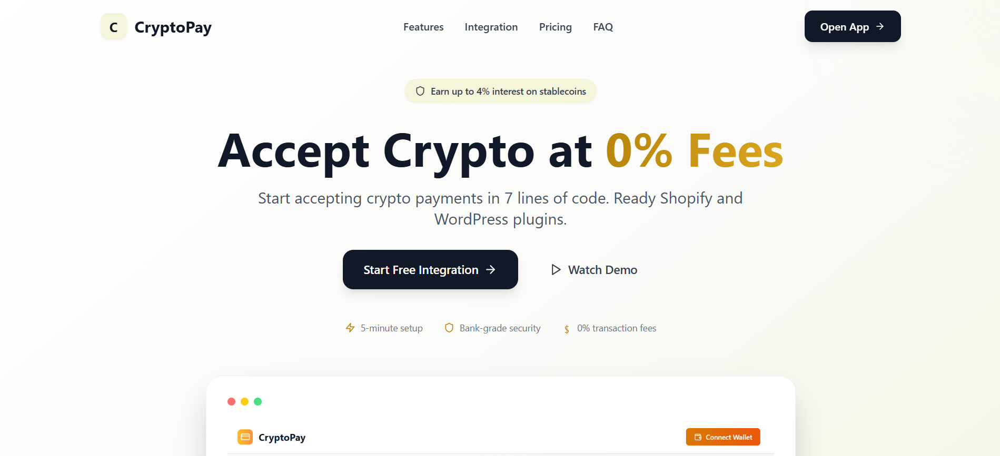

# ZapPay 

> ZapPay is a cryptocurrency payment protocol built on top of the x402 protocol. This protocol enables merchants to accept crypto payments seamlessly via a Stripe-like experience.

We extend Coinbase's x402 protocol to become the first 0% rate web3 payment gateway and deploy our facilitator on Scroll. We also provide up to 4% interest for stablecoins held in our accounts. We prepare ready WordPress plugins, Shopify plugins and allow merchants to accept crypto payments in 7 lines of code.  



## 🚀 Project Overview

This project is a fork of the x402 protocol example, enhanced with landing page, merchant frontend, and customized server side (we didn't include the facilitator yet since the facilitator is chain-agnostic, currently using the Base Sepolia for testing purpose):

- **Client**: Browser wallet integration for end users
- **Server**: Backend API for payment processing
- **Landing Page**: Marketing website for the ZapPay
- **Merchant Frontend**: Dashboard for merchants to manage payments

## 📁 Project Structure

```
browser-wallet-example/
├── client/                 # Browser wallet client application
├── server/                 # Backend API server
├── landing-page/           # Marketing landing page
├── merchant-frontend/      # Merchant dashboard
├── env.example            # Environment variables template
└── package.json           # Root package configuration
```

## 🛠️ Technology Stack

### Core Technologies
- **TypeScript** - Type-safe development
- **React 18** - Frontend framework
- **Vite** - Build tool and dev server
- **Tailwind CSS** - Utility-first CSS framework
- **Viem** - Ethereum library for wallet interactions

### Backend
- **Hono** - Fast web framework
- **x402-hono** - x402 protocol integration
- **Node.js** - Runtime environment

### Frontend Components
- **Radix UI** - Accessible component primitives
- **Lucide React** - Icon library
- **React Router** - Client-side routing
- **React Hook Form** - Form handling
- **Zod** - Schema validation

## 🚀 Quick Start

### Prerequisites
- Node.js 18+ 
- npm or yarn
- Git

### Installation

1. **Clone the repository**
   ```bash
   git clone <repository-url>
   cd browser-wallet-example
   ```

2. **Install all dependencies**
   ```bash
   npm run install:all
   ```

3. **Set up environment variables**
   ```bash
   cp env.example .env
   ```
   
   Edit `.env` with your configuration:
   ```env
       # x402 Configuration
    ADDRESS=0xYOUR_WALLET_ADDRESS_HERE
    NETWORK=base-sepolia
    FACILITATOR_URL=https://x402.org/facilitator
    PORT=3001

4. **Start the development servers**
   ```bash
   npm run dev
   ```

This will start all applications concurrently:
- **Server**: http://localhost:3001
- **Client**: the original fork x402 frontend
- **Landing Page**: http://localhost:5173
- **Merchant Frontend**: http://localhost:5174

## 📱 Applications

### 🏠 Landing Page (`/landing-page`)
A modern marketing website showcasing the crypto payment solution.

**Features:**
- Responsive design with Tailwind CSS
- Hero section with product mockup
- Features, pricing, and FAQ sections
- Call-to-action buttons linking to applications

**Tech Stack:**
- React + TypeScript
- Vite
- Tailwind CSS
- Lucide React icons

**Start:**
```bash
cd landing-page
npm run dev
```

### 💼 Merchant Frontend (`/merchant-frontend`)
A comprehensive dashboard for merchants to manage crypto payments.

**Features:**
- Modern dashboard with shadcn/ui components
- Payment management interface
- Transaction history and analytics
- Customer management
- Product catalog
- Billing and reporting

**Tech Stack:**
- React + TypeScript
- Vite
- Tailwind CSS
- Radix UI components
- React Router for navigation
- React Hook Form + Zod validation

**Start:**
```bash
cd merchant-frontend
npm run dev
```

### 👛 Client (`/client`)
Browser wallet integration for end users to make crypto payments.

**Features:**
- Wallet connection (MetaMask, WalletConnect, etc.)
- Payment processing with x402 protocol
- Transaction status tracking
- Responsive design

**Tech Stack:**
- React + TypeScript
- Vite
- Viem for Ethereum interactions
- x402-axios for API integration

**Start:**
```bash
cd client
npm run dev
```

### 🔧 Server (`/server`)
Backend API server handling payment processing and x402 protocol integration.

**Features:**
- RESTful API endpoints
- x402 protocol integration
- Payment processing
- Transaction management
- Environment-based configuration

**Tech Stack:**
- Node.js + TypeScript
- Hono web framework
- x402-hono integration
- Environment configuration

**Start:**
```bash
cd server
npm run dev
```

## 🔧 Development

### Available Scripts

**Root level:**
- `npm run dev` - Start all applications concurrently
- `npm run dev:server` - Start server only
- `npm run dev:client` - Start client only
- `npm run install:all` - Install dependencies for all applications

**Individual applications:**
- `npm run dev` - Start development server
- `npm run build` - Build for production
- `npm run preview` - Preview production build
- `npm run lint` - Run ESLint

### Environment Variables

Create a `.env` file in the root directory:

```env
# x402 Configuration
ADDRESS=0x7cAc6ECaA934999ad40a9666d017f186788CDe6E
NETWORK=base-sepolia
FACILITATOR_URL=https://x402.org/facilitator
PORT=3001

# Supabase Configuration (optional)
SUPABASE_URL=your_supabase_project_url
SUPABASE_SERVICE_ROLE_KEY=your_supabase_service_role_key
```

## 🌐 x402 Protocol Integration

This project demonstrates integration with the x402 protocol for crypto payments:

- **x402-axios**: Client-side integration for React applications
- **x402-hono**: Server-side integration for the backend API
- **Protocol Version**: 0.4.0

The x402 protocol enables:
- Zero-fee crypto payments
- Instant settlement
- Cross-chain compatibility
- Secure payment processing

## 🎨 UI/UX Features

### Design System
- **Tailwind CSS** for utility-first styling
- **Radix UI** for accessible component primitives
- **shadcn/ui** components in merchant frontend
- **Lucide React** for consistent iconography

### Responsive Design
- Mobile-first approach
- Responsive layouts across all applications
- Touch-friendly interfaces
- Cross-browser compatibility

## 🔒 Security

- Environment variable configuration
- Secure API endpoints
- Input validation with Zod
- Type-safe development with TypeScript

## 📦 Deployment

### Build for Production

```bash
# Build all applications
cd client && npm run build
cd ../server && npm run build
cd ../landing-page && npm run build
cd ../merchant-frontend && npm run build
```

### Deployment Options

- **Vercel**: Deploy frontend applications
- **Railway/Render**: Deploy backend server
- **Docker**: Containerized deployment
- **Static hosting**: For landing page

## 🤝 Contributing

1. Fork the repository
2. Create a feature branch
3. Make your changes
4. Add tests if applicable
5. Submit a pull request

## 📋 Todo

- [ ] Deploy facilitator on Scroll mainnet
- [ ] Implement WordPress plugin
- [ ] Implement Shopify plugin
- [ ] Add stablecoin interest earning feature
- [ ] Create mobile app for merchants
- [ ] Implement advanced analytics dashboard
- [ ] Add webhook support for payment notifications
- [ ] Create developer SDK
- [ ] Add support for more payment methods
- [ ] Implement recurring payment functionality
- [ ] Add fraud detection system
- [ ] Create white-label solution
- [ ] Add analytics and reporting feature
- [ ] Implement comprehensive billing system
- [ ] Create POS (Point of Sale) integration
- [ ] Integrate with [redacted] for on off-ramp services
- [ ] Add real-time transaction monitoring
- [ ] Implement merchant onboarding flow
- [ ] Implement customer loyalty program
- [ ] Add multi-currency support
- [ ] Create automated reconciliation system

## 📄 License

This project is based on the x402 protocol example. Please refer to the original x402 repository for licensing information.

## 🔗 Links

- [x402 Protocol Documentation](https://x402.org)
- [Viem Documentation](https://viem.sh)
- [Hono Documentation](https://hono.dev)
- [Tailwind CSS](https://tailwindcss.com)
- [Radix UI](https://www.radix-ui.com)

## 🆘 Support

For issues related to:
- **x402 Protocol**: Check the official x402 documentation
- **This Example**: Open an issue in this repository
- **General Questions**: Check the documentation links above
